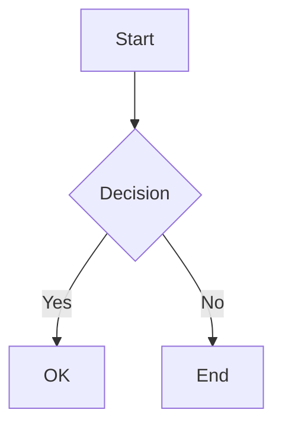

# SophiChain Documentation (Docusaurus)

## ✅ Fixed Issues

### Document ID Slashes Error
**Problem:** Docusaurus v3 does not allow slashes in document IDs in frontmatter.

**Solution:** Removed all `id` fields with slashes from frontmatter. Docusaurus now auto-generates IDs from file paths.

**What was fixed:**
- ❌ Before: `id: architecture/api-design` (ERROR)
- ✅ After: No `id` field (auto-generated from file path)

### Deprecated Config Option
**Problem:** `onBrokenMarkdownLinks` is deprecated in Docusaurus v3.

**Solution:** Removed the deprecated option and added Mermaid diagram support.

## 📁 Project Structure

```
website/
├── docs/                          # All documentation
│   ├── intro.md                  # Main introduction
│   ├── contributing.md
│   ├── directory-structure.md
│   ├── getting-started/
│   ├── architecture/             # Architecture docs
│   ├── modules/                  # Module docs
│   │   ├── index.md             # Modules overview
│   │   ├── financehub/
│   │   ├── aihub/
│   │   ├── commhub/
│   │   └── ...
│   ├── security/
│   └── deployment/
├── src/
│   ├── components/
│   │   └── HomepageFeatures/
│   ├── css/
│   │   └── custom.css
│   └── pages/
│       └── index.tsx             # Homepage
├── static/                       # Static assets
│   └── img/
├── docusaurus.config.ts         # Main configuration
├── sidebars.ts                  # Sidebar navigation
└── package.json
```

## 🚀 Usage

### Start Development Server
```bash
npm start
```
Opens browser at `http://localhost:3000`

### Build for Production
```bash
npm run build
```
Generates static files in `build/` directory

### Serve Production Build
```bash
npm run serve
```
Test production build locally

### Clear Cache
```bash
npm run clear
```
Clear Docusaurus cache (useful when things go wrong)

## 📝 Writing Documentation

### Adding New Documents

1. Create a new `.md` file in the appropriate directory
2. Add minimal frontmatter (or none at all):

```markdown
---
title: Your Title
sidebar_label: Sidebar Label
---

# Your Content
```

3. Add to `sidebars.ts`:

```typescript
{
  type: 'category',
  label: 'My Category',
  items: [
    'folder/filename',  // Note: Use path without .md extension
  ],
}
```

### Markdown Features

Docusaurus supports:

**Standard Markdown:**
- Headers, lists, links, images
- Code blocks with syntax highlighting
- Tables

**MDX (React components):**
```jsx
import MyComponent from '@site/src/components/MyComponent';

<MyComponent />
```

**Admonitions:**
```markdown
:::note
This is a note
:::

:::tip
This is a tip
:::

:::info
This is info
:::

:::caution
This is a caution
:::

:::danger
This is a danger warning
:::
```

**Tabs:**
```markdown
import Tabs from '@theme/Tabs';
import TabItem from '@theme/TabItem';

<Tabs>
  <TabItem value="js" label="JavaScript">
    ```js
    console.log('Hello');
    ```
  </TabItem>
  <TabItem value="py" label="Python">
    ```py
    print('Hello')
    ```
  </TabItem>
</Tabs>
```

**Mermaid Diagrams:**
````markdown

````

## 🎨 Customization

### Colors & Branding

Edit `src/css/custom.css`:

```css
:root {
  --ifm-color-primary: #2e5c8a;
  --ifm-color-primary-dark: #295280;
  /* ... adjust colors ... */
}
```

### Logo & Favicon

Replace these files:
- `static/img/logo.svg` - Your logo
- `static/img/favicon.ico` - Your favicon

### Homepage

Edit `src/pages/index.tsx` to customize the homepage.

### Navigation

Edit `docusaurus.config.ts` navbar section:

```typescript
navbar: {
  title: 'SophiChain',
  logo: {
    alt: 'SophiChain Logo',
    src: 'img/logo.svg',
  },
  items: [
    // Add/remove navigation items
  ],
}
```

## 🔍 Search

### Option 1: Algolia DocSearch (Recommended)

1. Apply at https://docsearch.algolia.com/apply/
2. Uncomment and configure in `docusaurus.config.ts`:

```typescript
algolia: {
  appId: 'YOUR_APP_ID',
  apiKey: 'YOUR_API_KEY',
  indexName: 'sophichain',
},
```

### Option 2: Local Search Plugin

```bash
npm install --save @easyops-cn/docusaurus-search-local
```

Add to config:

```typescript
themes: [
  '@docusaurus/theme-mermaid',
  [
    require.resolve("@easyops-cn/docusaurus-search-local"),
    {
      hashed: true,
    },
  ],
],
```

## 📊 Analytics

Add Google Analytics to `docusaurus.config.ts`:

```typescript
themeConfig: {
  gtag: {
    trackingID: 'G-XXXXXXXXXX',
  },
}
```

## 🚀 Deployment

### GitHub Pages

```bash
GIT_USER=<username> npm run deploy
```

### Netlify

1. Connect repository to Netlify
2. Build command: `npm run build`
3. Publish directory: `build`

### Vercel

1. Import repository to Vercel
2. Root directory: `website`
3. Build command: `npm run build`
4. Output directory: `build`

### Docker

```dockerfile
FROM node:18-alpine
WORKDIR /app
COPY package*.json ./
RUN npm install
COPY . .
RUN npm run build
FROM nginx:alpine
COPY --from=0 /app/build /usr/share/nginx/html
```

## 🐛 Troubleshooting

### Port already in use
```bash
PORT=3001 npm start
```

### Cache issues
```bash
npm run clear
rm -rf .docusaurus
npm start
```

### Build fails
```bash
npm run clear
rm -rf node_modules package-lock.json
npm install
npm run build
```

### Document not appearing in sidebar
1. Check file path matches sidebar reference
2. Ensure frontmatter is correct
3. Clear cache and restart

## 📚 Resources

- **Docusaurus Docs:** https://docusaurus.io/docs
- **Markdown Features:** https://docusaurus.io/docs/markdown-features
- **Deployment:** https://docusaurus.io/docs/deployment
- **SophiChain Repo:** https://github.com/sophichain

## 🤝 Contributing

When contributing documentation:

1. Follow existing structure and naming
2. Use clear, concise language
3. Add code examples where helpful
4. Test locally before submitting
5. Update sidebars.ts if adding new pages

## 📄 License

MIT License - Copyright © 2025 SophiLabs

---

**Questions?** Open an issue or contact info@sophilabs.ir