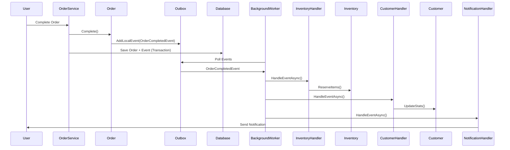
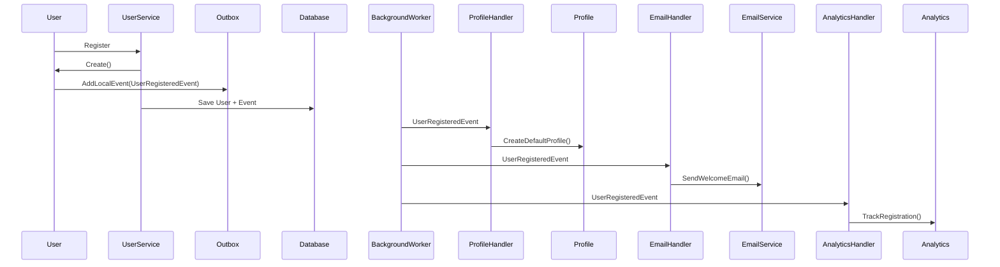

id: event-driven-architecture
# Event-Driven Architecture in SophiChain

> **Reliable Event Processing with ABP Event Bus & Outbox Pattern**

---

id: event-driven-architecture
## 📖 Overview

SophiChain uses event-driven architecture to enable loose coupling between modules and ensure reliable, asynchronous processing. All events are processed through ABP Framework's Event Bus with the Outbox pattern for guaranteed delivery.

---

id: event-driven-architecture
## 🎯 Core Concepts

### Why Event-Driven Architecture?

**Benefits:**
- ✅ **Loose Coupling** - Modules don't directly depend on each other
- ✅ **Scalability** - Async processing doesn't block main thread
- ✅ **Reliability** - Outbox pattern ensures no event loss
- ✅ **Extensibility** - Add new event handlers without changing publishers
- ✅ **Audit Trail** - Complete event history
- ✅ **Temporal Decoupling** - Publishers and consumers don't need to be online simultaneously

**Use Cases:**
- Order completed → Update inventory + Send confirmation + Track analytics
- User registered → Create profile + Send welcome email + Initialize preferences
- Resource created → Send notification + Update dashboard + Track metrics

---

id: event-driven-architecture
## 🏗️ Architecture Components

### 1. Domain Events (Local Events)

**Purpose:** Events within same module/application

**Flow:**
```
Entity/Aggregate
    ↓ AddLocalEvent()
Outbox Table (DB)
    ↓ Background Worker
Event Handlers
```

**Example:**
```csharp
// 1. Define Event
public class OrderCompletedEvent
{
    public Guid OrderId { get; set; }
    public Guid CustomerId { get; set; }
    public decimal TotalAmount { get; set; }
    public DateTime CompletedAt { get; set; }
}

// 2. Publish from Entity
public class Order : AggregateRoot<Guid>
{
    public void Complete()
    {
        Status = OrderStatus.Completed;
        CompletedAt = Clock.Now;
        
        // Event added to aggregate
        AddLocalEvent(new OrderCompletedEvent
        {
            OrderId = Id,
            CustomerId = CustomerId,
            TotalAmount = TotalAmount,
            CompletedAt = CompletedAt
        });
    }
}

// 3. Handle Event
public class OrderCompletedEventHandler 
    : ILocalEventHandler<OrderCompletedEvent>,
      ITransientDependency
{
    private readonly IInventoryService _inventoryService;
    private readonly ICustomerRepository _customerRepository;
    private readonly INotificationService _notificationService;
    
    public virtual async Task HandleEventAsync(OrderCompletedEvent eventData)
    {
        // Update inventory
        await _inventoryService.ReserveItemsAsync(eventData.OrderId);
        
        // Update customer stats
        var customer = await _customerRepository.GetAsync(eventData.CustomerId);
        customer.UpdateTotalSpent(eventData.TotalAmount);
        await _customerRepository.UpdateAsync(customer);
        
        // Send notification
        await _notificationService.SendAsync(
            eventData.CustomerId,
            "Order completed successfully");
    }
}
```

---

id: event-driven-architecture
### 2. Distributed Events

**Purpose:** Events across different microservices/applications

**Flow:**
```
Publisher Service
    ↓ PublishAsync()
Message Broker (RabbitMQ/Kafka)
    ↓
Subscriber Service(s)
    ↓
Event Handlers
```

**Example:**
```csharp
// Publish distributed event
public class OrderAppService : ApplicationService
{
    private readonly IDistributedEventBus _distributedEventBus;
    
    public async Task CreateOrderAsync(CreateOrderDto input)
    {
        var order = new Order(...);
        await _orderRepository.InsertAsync(order);
        
        // Publish to other services
        await _distributedEventBus.PublishAsync(
            new OrderCreatedEto // Event Transfer Object
            {
                OrderId = order.Id,
                UserId = order.UserId,
                TotalAmount = order.Total
            });
    }
}

// Subscribe in another service
public class OrderCreatedEventHandler 
    : IDistributedEventHandler<OrderCreatedEto>,
      ITransientDependency
{
    public async Task HandleEventAsync(OrderCreatedEto eventData)
    {
        // Process in different service
    }
}
```

---

id: event-driven-architecture
## ⚙️ Outbox Pattern Implementation

### What is Outbox Pattern?

**Problem:** How to reliably publish events when saving entity changes?
- If you save entity THEN publish event → Event might fail, data inconsistent
- If you publish event THEN save entity → Entity save might fail, event already sent

**Solution:** Store events in database in same transaction as entity changes

### How ABP Implements It

**Step 1: Enable Outbox**
```csharp
public override void ConfigureServices(ServiceConfigurationContext context)
{
    Configure<AbpEventBusBoxesOptions>(options =>
    {
        options.OutboxConfig.Enabled = true;
    });
}
```

**Step 2: Events Stored Automatically**
When you save entity with events:
```csharp
// Transaction begins
var order = new Order();
order.Complete(); // Adds OrderCompletedEvent
await _repository.UpdateAsync(order);
// Transaction commits:
//   - Order entity saved
//   - Event saved to outbox table
//   ✅ Both succeed or both fail (atomic)
```

**Step 3: Background Worker Processes Events**
```
Background Worker (every X seconds)
    ↓
SELECT * FROM AbpEventOutbox WHERE IsProcessed = false
    ↓
FOR EACH event:
    ↓
    Execute Handler
    ↓
    Mark as Processed
```

**Benefits:**
- ✅ **Atomic** - Events and entity changes in same transaction
- ✅ **Reliable** - Events never lost
- ✅ **Automatic Retry** - Failed events retry automatically
- ✅ **Idempotent** - Events processed exactly once

---

id: event-driven-architecture
## 🎨 Event Handler Patterns

### Handler Registration

**Automatic Registration:**
```csharp
// Just implement interface + ITransientDependency
public class MyEventHandler 
    : ILocalEventHandler<MyEvent>,
      ITransientDependency
{
    // ABP auto-discovers and registers
}
```

### Handler Best Practices

**1. Make Handlers Idempotent**
```csharp
public class OrderCompletedHandler : ILocalEventHandler<OrderCompletedEvent>
{
    public async Task HandleEventAsync(OrderCompletedEvent e)
    {
        // Check if already processed
        var existing = await _analyticsRepo.FindByOrderIdAsync(e.OrderId);
        if (existing != null)
            return; // Already processed
        
        // Process event
        var analytics = new OrderAnalytics
        {
            OrderId = e.OrderId,
            TotalAmount = e.TotalAmount
        };
        await _analyticsRepo.InsertAsync(analytics);
    }
}
```

**2. Keep Handlers Focused**
```csharp
// ❌ Bad: One handler does everything
public class OrderCompletedHandler : ILocalEventHandler<OrderCompletedEvent>
{
    public async Task HandleEventAsync(OrderCompletedEvent e)
    {
        // Update inventory
        // Update customer stats
        // Send notification
        // Update analytics
        // Trigger loyalty points
        // Generate invoice
        // ... too much!
    }
}

// ✅ Good: Multiple focused handlers
public class UpdateInventoryHandler : ILocalEventHandler<OrderCompletedEvent>
{
    public async Task HandleEventAsync(OrderCompletedEvent e)
    {
        await _inventoryService.ReserveItemsAsync(e.OrderId);
    }
}

public class UpdateCustomerStatsHandler : ILocalEventHandler<OrderCompletedEvent>
{
    public async Task HandleEventAsync(OrderCompletedEvent e)
    {
        var customer = await _customerRepo.GetAsync(e.CustomerId);
        customer.UpdateTotalSpent(e.TotalAmount);
        await _customerRepo.UpdateAsync(customer);
    }
}
```

**3. Handle Errors Gracefully**
```csharp
public class NotificationHandler : ILocalEventHandler<OrderCompletedEvent>
{
    private readonly ILogger<NotificationHandler> _logger;
    
    public async Task HandleEventAsync(OrderCompletedEvent e)
    {
        try
        {
            await _notificationService.SendAsync(e.CustomerId, "Order completed");
        }
        catch (Exception ex)
        {
            // Log error but don't throw
            // ABP will retry handler automatically
            _logger.LogError(ex, 
                "Failed to send notification for order {OrderId}", 
                e.OrderId);
        }
    }
}
```

**4. Use Background Jobs for Long Operations**
```csharp
public class GenerateInvoiceHandler : ILocalEventHandler<OrderCompletedEvent>
{
    private readonly IBackgroundJobManager _jobManager;
    
    public async Task HandleEventAsync(OrderCompletedEvent e)
    {
        // Don't generate PDF here (slow)
        // Queue background job instead
        await _jobManager.EnqueueAsync(new GenerateInvoiceArgs
        {
            OrderId = e.OrderId
        });
    }
}
```

---

id: event-driven-architecture
## 📊 Event Flow Examples

### Example 1: Order Processing Flow



### Example 2: User Registration



---

id: event-driven-architecture
## ⚙️ Configuration

### Enable Local Events with Outbox

```csharp
[DependsOn(typeof(AbpEventBusModule))]
public class MyModule : AbpModule
{
    public override void ConfigureServices(ServiceConfigurationContext context)
    {
        Configure<AbpEventBusBoxesOptions>(options =>
        {
            // Enable outbox pattern
            options.OutboxConfig.Enabled = true;
            
            // Optional: Configure batch size
            options.OutboxConfig.BatchSize = 100;
            
            // Optional: Configure selector
            options.OutboxConfig.SelectorName = "MySelector";
        });
    }
}
```

### Enable Distributed Events

**RabbitMQ Example:**
```csharp
[DependsOn(typeof(AbpEventBusRabbitMqModule))]
public class MyModule : AbpModule
{
    public override void ConfigureServices(ServiceConfigurationContext context)
    {
        var configuration = context.Services.GetConfiguration();
        
        Configure<AbpRabbitMqEventBusOptions>(options =>
        {
            options.ClientName = "MyApp";
            options.ExchangeName = "MyApp.Events";
        });
        
        Configure<AbpRabbitMqOptions>(options =>
        {
            options.Connections.Default.HostName = configuration["RabbitMQ:Host"];
            options.Connections.Default.UserName = configuration["RabbitMQ:UserName"];
            options.Connections.Default.Password = configuration["RabbitMQ:Password"];
        });
    }
}
```

**Azure Service Bus Example:**
```csharp
[DependsOn(typeof(AbpEventBusAzureModule))]
public class MyModule : AbpModule
{
    public override void ConfigureServices(ServiceConfigurationContext context)
    {
        Configure<AbpAzureEventBusOptions>(options =>
        {
            options.ConnectionString = 
                context.Services.GetConfiguration()["Azure:ServiceBus:ConnectionString"];
            options.TopicName = "MyApp.Events";
        });
    }
}
```

---

id: event-driven-architecture
## 🎯 Common Event Patterns

### 1. Cascade Operations

**Pattern:** One event triggers multiple handlers that each do one thing

```csharp
// Event
public class OrderCompletedEvent { }

// Handlers
public class UpdateInventoryHandler : ILocalEventHandler<OrderCompletedEvent> { }
public class SendConfirmationEmailHandler : ILocalEventHandler<OrderCompletedEvent> { }
public class UpdateAnalyticsHandler : ILocalEventHandler<OrderCompletedEvent> { }
public class TriggerShippingHandler : ILocalEventHandler<OrderCompletedEvent> { }
```

### 2. Event Chains

**Pattern:** Handler publishes new event, creating a chain

```csharp
// Handler 1: Publishes new event
public class OrderCompletedHandler : ILocalEventHandler<OrderCompletedEvent>
{
    public async Task HandleEventAsync(OrderCompletedEvent e)
    {
        var shipment = await CreateShipmentAsync(e.OrderId);
        shipment.MarkAsReady();
        // This publishes ShipmentReadyEvent
    }
}

// Handler 2: Responds to new event
public class ShipmentReadyHandler : ILocalEventHandler<ShipmentReadyEvent>
{
    public async Task HandleEventAsync(ShipmentReadyEvent e)
    {
        // Notify shipping provider, etc.
    }
}
```

### 3. Saga Pattern (Long-Running Transactions)

**Pattern:** Coordinate multiple steps with compensation

```csharp
public class OrderSagaHandler : ILocalEventHandler<OrderCreatedEvent>
{
    public async Task HandleEventAsync(OrderCreatedEvent e)
    {
        try
        {
            // Step 1: Reserve inventory
            await _inventoryService.ReserveAsync(e.Items);
            
            // Step 2: Validate customer credit
            await _creditService.ValidateAsync(e.CustomerId, e.TotalAmount);
            
            // Step 3: Create shipment
            await _shippingService.CreateShipmentAsync(e.OrderId);
        }
        catch (Exception ex)
        {
            // Compensation: Rollback steps
            await _inventoryService.ReleaseAsync(e.Items);
            await _creditService.ReleaseReservationAsync(e.CustomerId);
            
            // Publish failure event
            await _eventBus.PublishAsync(new OrderFailedEvent { OrderId = e.OrderId });
        }
    }
}
```

---

id: event-driven-architecture
## ✅ Best Practices

### Event Design
- ✅ Include minimal data (IDs + key fields)
- ✅ Include timestamp and user context
- ✅ Use past tense names (OrderCreated, PaymentCompleted)
- ✅ Make events immutable (read-only properties)
- ❌ Don't include entire entities

### Handler Design
- ✅ One responsibility per handler
- ✅ Make idempotent
- ✅ Handle errors gracefully
- ✅ Log extensively
- ✅ Keep fast (queue long operations)
- ❌ Don't call external APIs synchronously

### Performance
- ✅ Use outbox batch processing
- ✅ Index outbox table properly
- ✅ Archive processed events regularly
- ✅ Monitor handler performance
- ✅ Use distributed events for cross-service communication

---

id: event-driven-architecture
## 📚 References

- [ABP Event Bus Documentation](https://abp.io/docs/latest/framework/infrastructure/event-bus)
- [Outbox Pattern](https://microservices.io/patterns/data/transactional-outbox.html)
- [Event-Driven Architecture](https://martinfowler.com/articles/201701-event-driven.html)

---

id: event-driven-architecture
## 🎯 Module Examples

- **[FinanceHub Events](/modules/financehub/architecture#-domain-events)** - Complete event implementation
- **[AIHub Events](/modules/aihub)** - AI-specific events

---

id: event-driven-architecture
