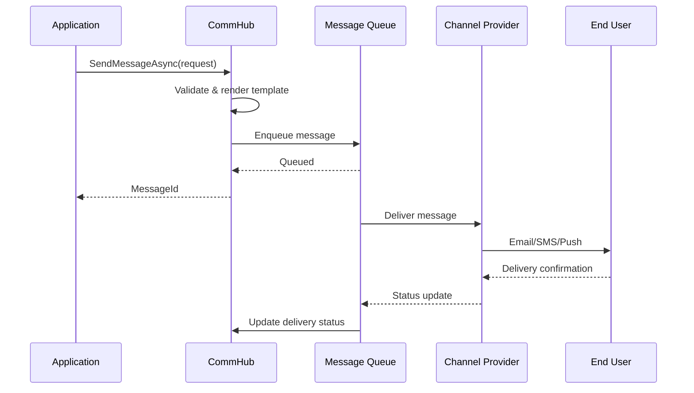

# CommHub - Communication Services Module

> **Unified Multi-Channel Messaging Infrastructure**

🚧 **Status: Documentation Coming Soon**

---

## Overview

**CommHub** is SophiChain's centralized communication infrastructure that handles all messaging across multiple channels:

- 📧 **Email** - Templated emails with HTML/plain text
- 📱 **SMS** - Transactional and bulk messaging
- 💬 **Telegram Bots** - Interactive bot integration
- 🔔 **Push Notifications** - Via ntfy.sh (open-source)
- 🎨 **AI Template Generator** - Auto-generate channel-specific templates
- 🔗 **Webhooks** - Event notifications to external systems

---

## Quick Preview

### Key Features (Planned)

✅ **Multi-Channel** - Single API for all communication channels  
✅ **Template Management** - Version-controlled message templates  
✅ **AI-Powered** - Generate templates from brief descriptions  
✅ **Rate Limiting** - Tenant-level policies and controls  
✅ **Delivery Tracking** - Monitor message delivery status  
✅ **A/B Testing** - Test message variants automatically  
✅ **Localization** - Multi-language template support

---

## Architecture Highlights

```
┌────────────────────────────────────────┐
│           CommHub Module               │
├────────────────────────────────────────┤
│  ┌──────────────────────────────────┐  │
│  │   Message Broker                 │  │
│  │  - Routing                       │  │
│  │  - Queueing                      │  │
│  │  - Delivery tracking             │  │
│  └──────────────────────────────────┘  │
│           ↓                             │
│  ┌──────────────────────────────────┐  │
│  │   Channel Abstraction            │  │
│  │  (IMessageChannel Interface)     │  │
│  └──────────────────────────────────┘  │
│     ↓       ↓       ↓       ↓          │
│  ┌─────┐ ┌─────┐ ┌────┐ ┌──────┐      │
│  │Email│ │ SMS │ │Tele│ │ Push │      │
│  └─────┘ └─────┘ └────┘ └──────┘      │
├────────────────────────────────────────┤
│  ┌──────────────────────────────────┐  │
│  │   AI Template Generator          │  │
│  │  - Brief → Template              │  │
│  │  - Channel-specific formatting   │  │
│  │  - Merge fields                  │  │
│  │  - A/B variants                  │  │
│  └──────────────────────────────────┘  │
└────────────────────────────────────────┘
```

---

## Use Cases

### 1. Send Transactional Email
```csharp
// Send order confirmation email
await _messageService.SendAsync(new SendMessageRequest
{
    Channel = MessageChannel.Email,
    TemplateCode = "order-confirmation",
    To = customer.Email,
    Variables = new Dictionary<string, object>
    {
        { "OrderNumber", order.Number },
        { "Total", order.Total },
        { "Items", order.Items }
    }
});
```

### 2. Send SMS Notification
```csharp
// Send OTP via SMS
await _messageService.SendAsync(new SendMessageRequest
{
    Channel = MessageChannel.SMS,
    TemplateCode = "otp-verification",
    To = user.PhoneNumber,
    Variables = new Dictionary<string, object>
    {
        { "Code", otpCode },
        { "ExpiryMinutes", 5 }
    }
});
```

### 3. AI Template Generation
```csharp
// Generate template from brief
var template = await _templateGenerator.GenerateAsync(new GenerateTemplateRequest
{
    Brief = "Send invoice payment reminder with due date and amount",
    Variables = new[] { "InvoiceNumber", "DueDate", "Amount", "CustomerName" },
    Channels = new[] { MessageChannel.Email, MessageChannel.SMS },
    Tone = "Professional and friendly"
});
```

### 4. Telegram Bot Integration
```csharp
// Handle Telegram command
await _telegramService.SendMessageAsync(new TelegramMessageRequest
{
    ChatId = chatId,
    Text = "Your order has been shipped! Track it here:",
    InlineKeyboard = new[]
    {
        new[] { new InlineKeyboardButton("Track Order", trackingUrl) }
    }
});
```

---

## Channel Providers

| Channel | Provider | Status |
|---------|----------|--------|
| Email | SendGrid | 🔴 Planned |
| Email | Amazon SES | 🔴 Planned |
| Email | SMTP | 🔴 Planned |
| SMS | Twilio | 🔴 Planned |
| SMS | Kavenegar (Iran) | 🔴 Planned |
| Telegram | Telegram Bot API | 🔴 Planned |
| Push | ntfy.sh | 🔴 Planned |
| Push | FCM | 🔴 Planned |

---

## AI Template Generator

### How It Works

1. **Input:** Brief description + variables + channel(s)
2. **Processing:** AIHub generates appropriate templates
3. **Output:** Channel-specific formatted templates
4. **Review:** Admin reviews and approves
5. **Deploy:** Templates available for use

### Example

**Input:**
```
Brief: "Notify user their payment failed with error message"
Variables: CustomerName, Amount, Currency, ErrorMessage, RetryUrl
Channels: Email, SMS
```

**Output:**

**Email Template:**
```html
<h2>Payment Failed</h2>
<p>Hi {{CustomerName}},</p>
<p>We were unable to process your payment of {{Amount}} {{Currency}}.</p>
<p><strong>Reason:</strong> {{ErrorMessage}}</p>
<p><a href="{{RetryUrl}}">Retry Payment</a></p>
```

**SMS Template:**
```
Hi {{CustomerName}}, your payment of {{Amount}} {{Currency}} failed: {{ErrorMessage}}. Retry here: {{RetryUrl}}
```

---

## Integration with Other Modules

### FinanceHub Integration
- Invoice notifications
- Payment confirmations
- Receipt delivery
- Payment reminders

### AIHub Integration
- AI template generation
- Content optimization
- Sentiment analysis
- Language translation

### HelpDesk Integration
- Ticket notifications
- Agent assignments
- Customer updates
- SLA alerts

---

## Message Flow



---

## Documentation Status

📝 **Comprehensive documentation is in development**

Expected completion: **2026 Q3**

### What's Coming

- [ ] Architecture overview
- [ ] Channel provider setup
- [ ] Template management guide
- [ ] AI template generator tutorial
- [ ] Rate limiting configuration
- [ ] Webhook setup
- [ ] API reference
- [ ] Best practices

---

## Stay Updated

- ⭐ **Star the repository** to get notifications
- 📧 **Subscribe to updates** via GitHub Watch
- 💬 **Join discussions** for early previews

---

## Related Documentation

- [SophiChain Overview](../../)
- [FinanceHub Documentation](/modules/financehub)
- [AIHub Documentation](/modules/aihub)

---

*Documentation Coming: Q3 2026*  
*Module Status: Planning*

---

**Have questions?** Open a [Discussion](https://github.com/sophichain/discussions) or [Issue](https://github.com/sophichain/issues)!

