id: flowcharts
# SophiChain FinanceHub - Architecture Flowcharts

This document contains comprehensive flowcharts for understanding the FinanceHub module architecture and key workflows.

---

id: flowcharts
## Table of Contents

- [1. Module Architecture Overview](#1-module-architecture-overview)
  - [1. Module Architecture Overview](#1-module-architecture-overview)
  - [2. Payment Flow (Complete)](#2-payment-flow-complete)
  - [3. Invoice Creation \& Payment](#3-invoice-creation--payment)
  - [4. Wallet Operations](#4-wallet-operations)
  - [5. Currency Conversion Flow](#5-currency-conversion-flow)
  - [6. Exchange Rate Update Flow](#6-exchange-rate-update-flow)
  - [7. Event-Driven Architecture](#7-event-driven-architecture)
  - [8. Pluggable Provider Architecture](#8-pluggable-provider-architecture)
  - [9. DeFi Treasury Auto-Conversion](#9-defi-treasury-auto-conversion)
  - [10. Gamification Reward Flow](#10-gamification-reward-flow)
  - [Additional Diagrams](#additional-diagrams)
    - [Entity Relationship Overview](#entity-relationship-overview)
    - [Permission Hierarchy](#permission-hierarchy)
  - [Summary](#summary)

---

id: flowcharts
## 1. Module Architecture Overview

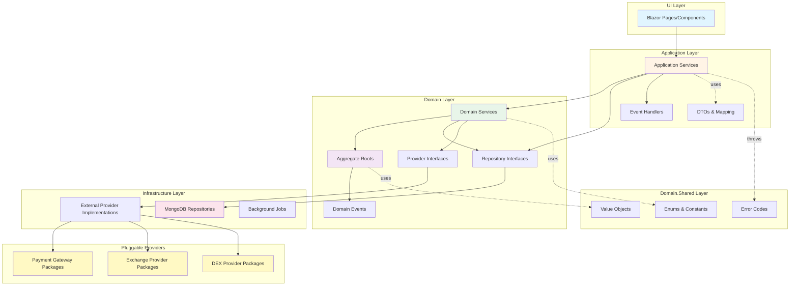

---

id: flowcharts
## 2. Payment Flow (Complete)

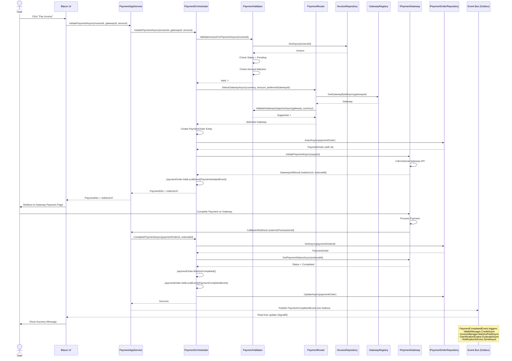

---

id: flowcharts
## 3. Invoice Creation & Payment

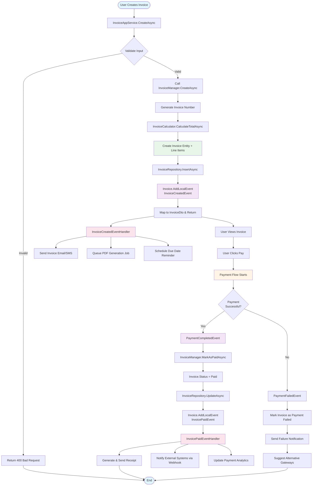

---

id: flowcharts
## 4. Wallet Operations

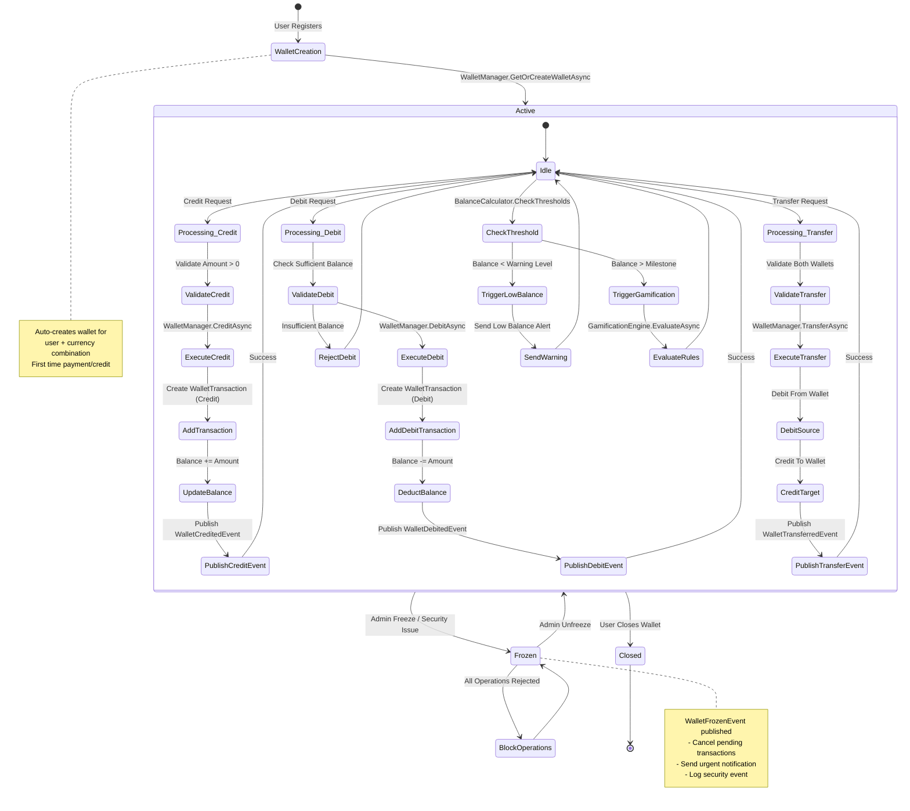

---

id: flowcharts
## 5. Currency Conversion Flow

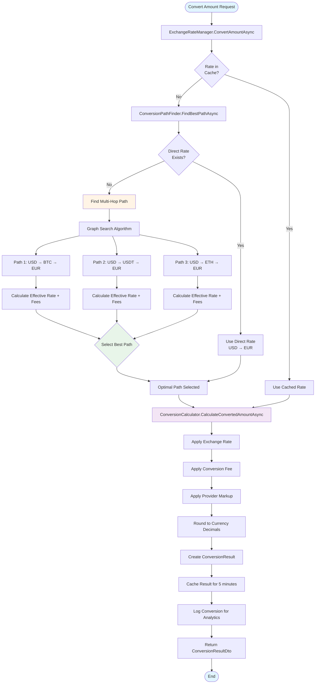

**Multi-Hop Conversion Example:**
- Converting 100 USD to EUR
- Path: USD → BTC → EUR
- Step 1: 100 USD = 0.0025 BTC
- Step 2: 0.0025 BTC = 85 EUR
- Effective Rate: 1 USD = 0.85 EUR

---

id: flowcharts
## 6. Exchange Rate Update Flow

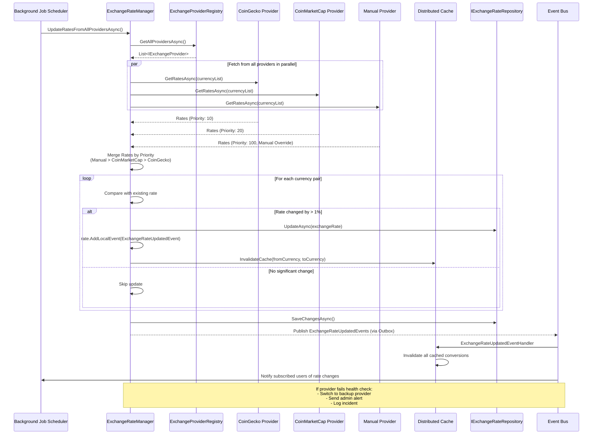

---

id: flowcharts
## 7. Event-Driven Architecture

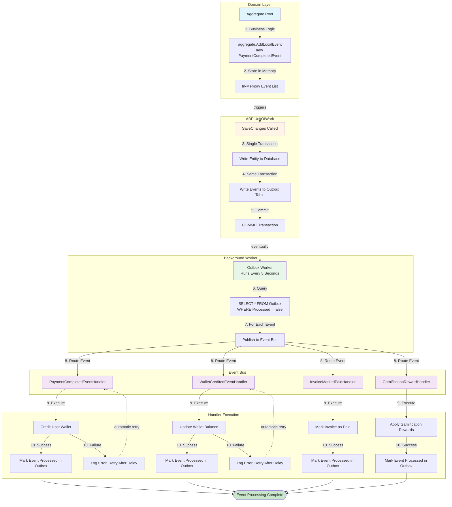

**Event Processing Guarantees:**
- ✓ Events never lost (stored in outbox table)
- ✓ At-least-once delivery (automatic retries)
- ✓ Eventual consistency (handled asynchronously)
- ✓ Automatic retries on failure
- ✓ Idempotency (same event processed once)

---

id: flowcharts
## 8. Pluggable Provider Architecture

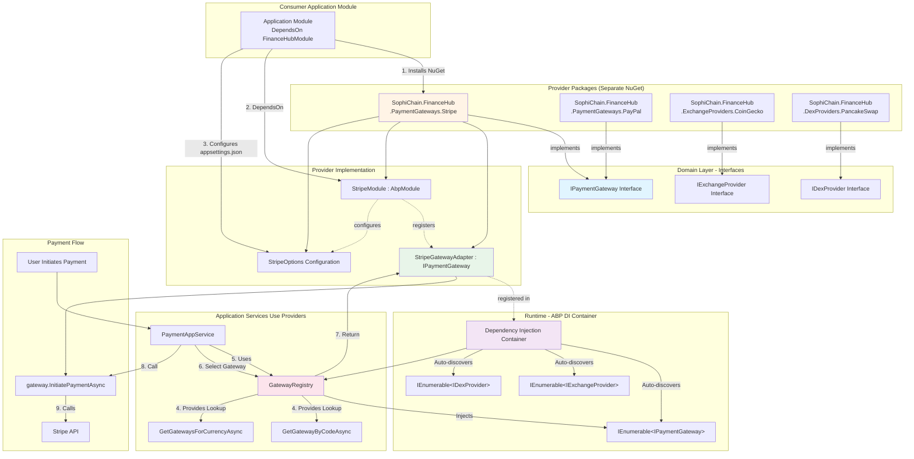

**Key Benefits:**
- ✓ Zero source code changes needed to add providers
- ✓ Add providers via NuGet packages
- ✓ Auto-discovery through ABP DI
- ✓ Easy testing with mock providers
- ✓ Third-party extensibility for developers

---

id: flowcharts
## 9. DeFi Treasury Auto-Conversion

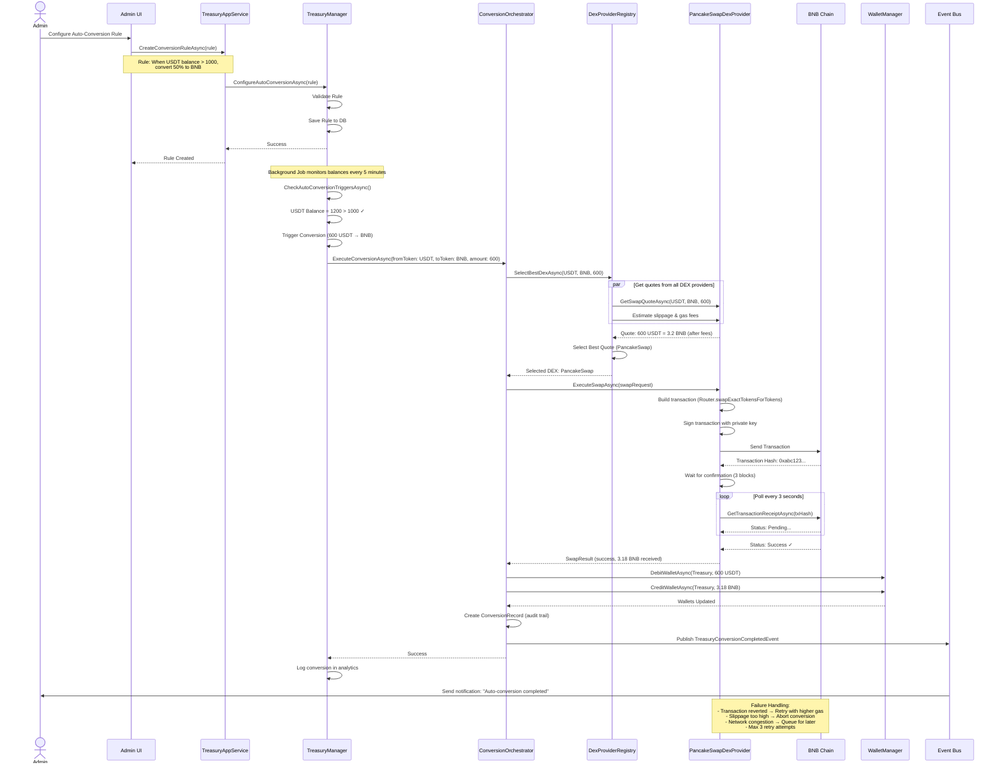

---

id: flowcharts
## 10. Gamification Reward Flow

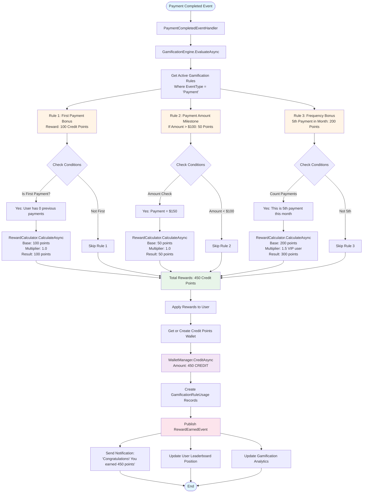

**Rule Engine Features:**
- ✓ Conditional evaluation (check multiple conditions)
- ✓ Multiple rewards per event
- ✓ Multipliers for VIP users
- ✓ Caps per rule and per user
- ✓ Time-based rules (daily, weekly, monthly)
- ✓ Complete audit trail

---

id: flowcharts
## Additional Diagrams

### Entity Relationship Overview

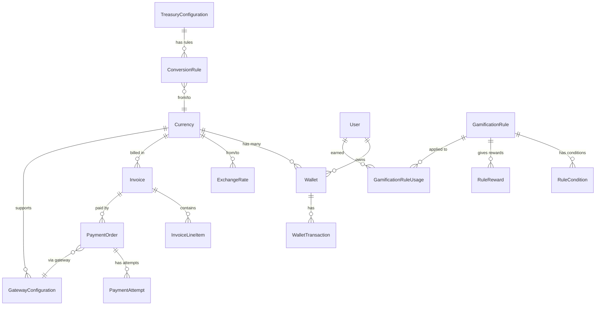

---

id: flowcharts
### Permission Hierarchy

```mermaid
graph TB
    FinanceHub[FinanceHub Root Permission]
    
    FinanceHub --> Currency[Currency Permissions]
    FinanceHub --> Payment[Payment Permissions]
    FinanceHub --> Wallet[Wallet Permissions]
    FinanceHub --> Invoice[Invoice Permissions]
    FinanceHub --> Gateway[Gateway Permissions]
    FinanceHub --> ExchangeRate[Exchange Rate Permissions]
    FinanceHub --> Gamification[Gamification Permissions]
    FinanceHub --> Treasury[Treasury Permissions]
    
    Currency --> CurrencyDefault[Currency.Default]
    Currency --> CurrencyCreate[Currency.Create]
    Currency --> CurrencyUpdate[Currency.Update]
    Currency --> CurrencyDelete[Currency.Delete]
    Currency --> CurrencyAdmin[Currency.Admin]
    
    Payment --> PaymentDefault[Payment.Default]
    Payment --> PaymentCreate[Payment.Create]
    Payment --> PaymentRefund[Payment.Refund]
    Payment --> PaymentAdmin[Payment.Admin]
    
    Wallet --> WalletMyWallets[Wallet.MyWallets]
    Wallet --> WalletCreate[Wallet.Create]
    Wallet --> WalletTransfer[Wallet.Transfer]
    Wallet --> WalletAdminCredit[Wallet.AdminCredit]
    Wallet --> WalletAdminFreeze[Wallet.AdminFreeze]
    
    Invoice --> InvoiceDefault[Invoice.Default]
    Invoice --> InvoiceCreate[Invoice.Create]
    Invoice --> InvoiceDelete[Invoice.Delete]
    Invoice --> InvoiceAdmin[Invoice.Admin]
    Invoice --> InvoiceMarkPaid[Invoice.AdminMarkPaid]
    
    style FinanceHub fill:#e1f5ff
    style Currency fill:#fff4e6
    style Payment fill:#e8f5e9
    style Wallet fill:#f3e5f5
    style Invoice fill:#fce4ec
```

---

id: flowcharts
## Summary

These flowcharts illustrate:

1. **Layered Architecture** - Clear separation between UI, Application, Domain, and Infrastructure
2. **Event-Driven Design** - Outbox pattern ensures reliable event processing
3. **Pluggable Providers** - NuGet packages extend functionality without source changes
4. **Complex Workflows** - Payment, conversion, and treasury operations
5. **Domain Services** - Orchestration of business logic across aggregates
6. **ABP Integration** - Leveraging ABP's built-in features for UnitOfWork, events, DI

All flows follow **ABP Framework best practices** and implement **Domain-Driven Design** principles.

---

id: flowcharts
